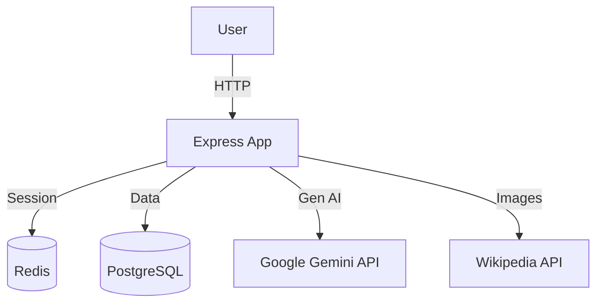
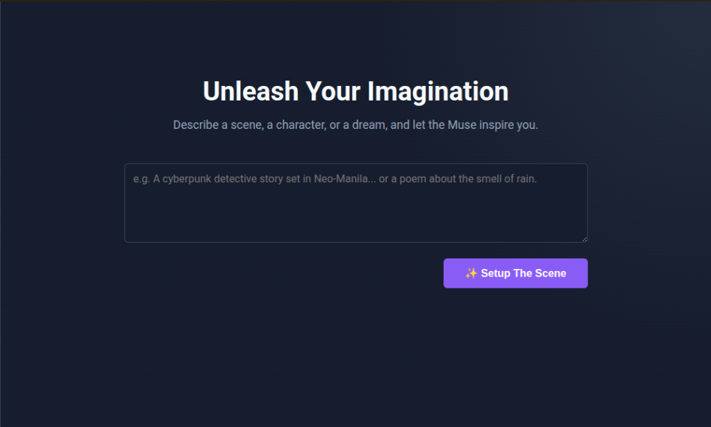

# Muse AI
> [!NOTE]
> This is an **EMPTECH (Empowerment Technologies)** academic project.


**Category:** Creative Content Outlet  
**Type:** SaaS Platform (Software as a Service)

> **Repository:** [https://codeberg.org/Mintdre/emptech-project](https://codeberg.org/Mintdre/emptech-project)

---

## 🚀 Get Started

### Prerequisites
*   Node.js 18+
*   PostgreSQL
*   Redis

### Installation
1.  **Clone the repo:**
    ```bash
    git clone https://codeberg.org/Mintdre/emptech-project.git
    cd emptech-project
    ```
2.  **Install dependencies:**
    ```bash
    npm install
    ```
3.  **Configure environment:**
    Copy `.env.example` to `.env` and fill in your keys (DB, Redis, Gemini API).
    ```bash
    cp .env.example .env
    ```
4.  **Run the app:**
    ```bash
    npm run dev
    ```
5.  **Visit:** `http://localhost:6769`

### Architecture


---

## 🎨 Why is this a "Creative Content Outlet"?

A **Creative Content Outlet** is defined as a platform that allows users to express their imagination and generate original artistic works. Muse AI fits this category perfectly because:

1.  **It Facilitates Expression:** Unlike rigid technical tools, Muse AI accepts abstract, emotional, or thematic prompts (e.g., *"A story about a robot who fears rust"*).
2.  **It Generates Art:** The output is **Creative Fiction**, **Poetry**, **Scripts**, and **Lore**, not just data or reports.
3.  **It Overcomes Blocks:** It serves as a collaborative partner (a "Muse") for writers who are stuck, providing the initial spark needed for creative flow.
4.  **It Preserves Creation:** The built-in portfolio acts as a gallery for the user's generated stories, allowing them to curate and export their best work.

---

## 1. Platform Name & Logo

**Name:** Muse AI

## 2. Purpose & Target Users

### Purpose
To democratize storytelling. Muse AI removes the barrier of the "blank page" by allowing anyone to become a creator. It transforms simple ideas into fully realized narratives, rich, descriptive scenes, and emotional poetry.

### Target Users
*   **Aspiring Authors:** who need help outlining plots or fleshing out scenes.
*   **Dungeon Masters & Roleplayers:** who need instant lore, NPC backstories, and world-building details.
*   **Content Creators:** who need engaging scripts or creative hooks for their audience.
*   **Students:** exploring creative writing prompts and styles.

## 3. Key Features & Functions

*   **✨ The Muse Engine:** A fine-tuned AI interface that prioritizes **creativity, tone, and emotional resonance** over factual density.
*   **📚 Living Portfolio:** A persistent, side-by-side view of all your past creations. Your history is your library.
*   **⬇️ Export to World:** Download your stories as clean Markdown (`.md`) files, ready to be published on blogs, Wattpad, or Ao3.
*   **👁️ "True Sight" Accessibility:** A robust high-contrast mode ensuring that creativity is accessible to users with visual impairments.
*   **🛡️ Secure & Private:** Your unfinished drafts and ideas are protected with enterprise-grade encryption.

## 4. User Interface (UI) & Accessibility

**Design Philosophy:** *Ethereal & Immersive.*
The UI uses a "Dream Mode" aesthetic—dark backgrounds with soft, glowing accents (`glassmorphism`) to reduce eye strain during late-night writing sessions and keep the user focused on the text.



### Accessibility (WCAG Compliance)
*   **True Sight Mode:** Instantly switches the UI to a strict High-Contrast (Black/Yellow) theme.
*   **Screen Reader Ready:** All interactive elements have ARIA labels (e.g., "Generate Story", "Download Draft").
*   **Keyboard First:** The entire application can be navigated using `Tab` and `Enter`, essential for users with motor disabilities.

## 5. Monetization Strategy (SaaS)

Muse AI uses a **Freemium Subscription** model to generate revenue while maintaining accessibility.

| Tier | Cost | Features |
| :--- | :--- | :--- |
| **Free** | $0/mo | Perfect for hobbyists. 10 stories/month. Standard creative model. |
| **Premium** | $9.99/mo | **Unlimited Creativity.** No caps on generation. Priority processing. |
| **Plus** | $19.99/mo | **Pro Model Access.** Uses the most advanced AI (Gemini Pro) for deeper, novel-length coherence and complex vocabulary. |

*Note: The platform features a fully functional payment gateway supporting Credit Cards, PayPal, and GCash.*

## 6. Security & Privacy

*   **AES-256 Encryption:** All user drafts are encrypted at rest using enterprise-grade encryption keys.
*   **Bcrypt Hashing:** Passwords are never stored in plain text.
*   **DOMPurify:** All generated text is sanitized to prevent XSS attacks while preserving formatting.
*   **Rate Limiting:** Protects the platform from abuse and ensures fair usage for all creators.
*   **Helmet.js:** Enforces secure HTTP headers to protect against web vulnerabilities.

---

## 🛠️ Technical Stack (Developer Info)
*   **Backend:** Node.js, Express.js
*   **Database:** PostgreSQL (User Data), Redis (Sessions)
*   **AI:** Google Gemini API
*   **Testing:** Jest, Supertest
*   **Images:** Wikipedia API

---

## 7. License

This project is licensed under the **MIT License**. See the [LICENSE](LICENSE) file for details.

## 🤖 Attribution

*   **Code assisted by:** Gemini AI